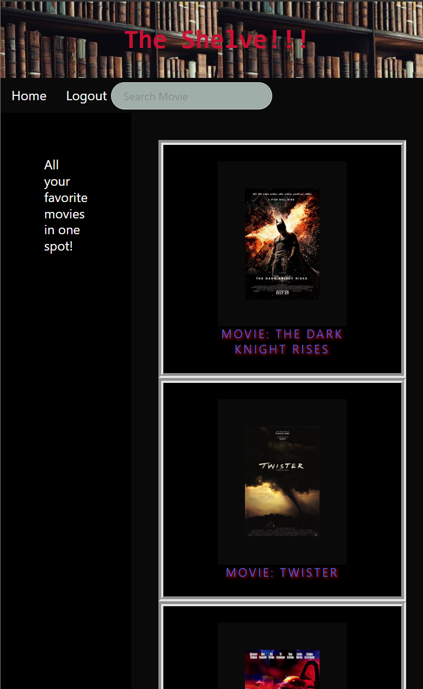

# The Shelve

## Description
The Shelve is a movie database to keep track of your personal collection of movies. Movie fanatics will have the ability to upload a list of their currently owned movies to the database to help them keep track of what they already own and make sure that duplicates are not being purchased. It can also be used to look up important information such as the movie plot and imdb rating about any movie you are considering on adding to your personal collection. 
## Table of contents
* [Installation](#Installation)
* [Usage](#Usage)
* [Visuals](#Visuals)
* [Links](#Link)
* [Collaborators](#collaborators)
* [License](#License)

## Installation

You’ll need to use the [MySQL2](https://www.npmjs.com/package/mysql2) and [Sequelize](https://www.npmjs.com/package/sequelize) packages to connect your Express.js API to a MySQL database and the [dotenv](https://www.npmjs.com/package/dotenv) package to use environment variables to store sensitive data.

Use the `schema.sql` file in the `db` folder to create your database with MySQL shell commands. Use environment variables to store sensitive data like your MySQL username, password, and database name.

## Usage 

## Visuals

## Links 
[Heroku](https://theshelve.herokuapp.com/)
[Github Repository](https://github.com/castarke/TheShelve)

## Collaborators 

**Candler Starke**
[Github Profile](https://github.com/castarke)

**Ruskin Acevedo**
[Github Profile](https://github.com/Ruskin20)

**Matthew Standish**
[Github Profile](https://github.com/MatthewStandish)

**Blake Sanders**
[Github Profile](https://github.com/blake1011001)

## License

